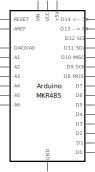

# MKR RS485 Shield

[Arduino Store](https://store.arduino.cc/products/arduino-mkr-485-shield)

This Fritzing part has been created fully from scratch, since there is no official part. The breadboard svg was taken from the [Arduino Docs](https://docs.arduino.cc/hardware/mkr-485-shield).

## Schematics

The schematics holds all the pins and connectors of the MKR board, although only a few are connected on the hardware itself. For more information, see the [Arduino Docs](https://docs.arduino.cc/hardware/mkr-485-shield).

The pins that must be connected are:
- +5V
- GND
- RX / TX (Receive and transmitt data)
- A5 / A6 (Receive and send enables)

## Notes on the board

Before connecting the board, mark the following things:
- When power supply voltage is attached via the screw connectors of the board, VIN is an **output** of this module with approx. +5V
- Even if one might think so, the board does not power itself. Despite the official documentation, the board does **NOT** work with +3,3V. That means that only +5V (+-5%) must be provided through the +5V connector.

