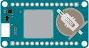

# MKR GPS Shield

[Arduino Store](https://store.arduino.cc/products/arduino-mkr-gps-shield)

This Fritzing part is basically the official Fritzing part from the [Arduino Docs](https://docs.arduino.cc/hardware/mkr-gps-shield). The problem with the official part was that it held internal connections that are not there in reallity. These internal connections have been removed in this version.