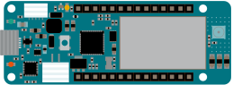

# Arduino MKR GSM 1400

[Arduino Store](https://store.arduino.cc/products/arduino-mkr-gsm-1400)

The MKR GSM Arduino board is based on the official Fritzing part. The original Fritzing part has the following problems:
- pcb svg is incorrect and has a size of 0 Bytes
- breadboard view had the wrong size so it does not match the pinheaders of the breadboard.
- schematics had a huge size

The following changes are done in this version:
- Created PCB based on an existing svg of the MKR Wifi and corrected the sizes and dimensions to match the real device
- corrected recreated breadboard view based on the svg from the [Arduino docs](https://docs.arduino.cc/hardware/mkr-gsm-1400)
- Using existing unofficial schematics from MKR Wifi, created a smaller version of the MKR GSM schematics.
