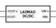

# LAOMAO DC-DC Step up Boost Converter

</img>

[Amazon.de Link](https://www.amazon.de/gp/product/B0B932BR7V)

This part is not yet available as Fritzing part. It therefore has been created from scratch.

## Technical data

|                        |                                                         |
| -----------------------| ------------------------------------------------------- |
| Input Voltage:         | DC 2V-24V                                               |
| Output Voltage:        | DC 5-28V (configurable)                                 |
| Output Current:        | 2A Maximum (recommended operation up to 1A)             |
| Efficiency：           | 93% Max                                                 |
| Size:                  | 36 mm x 17 mm x 14 mm (L \* B \* H)                     |
| Weight：               | 5 g                                                     |
| Operating Temperature：| -45°C ～ + 95°C                                         |
| Output Ripple：        | ＜100mV                                                 |
| Switching frequency:   | 1,2MHz                                                  |
| Load control:          | 0,5%                                                    |

## Schematics

Input voltage needs to be applied to the VIN +/- pins, the output voltage is set using the onboard potentiometer and is received on the VOUT pins. VOUT- and VIN- may be connected to each other to get a common base.
